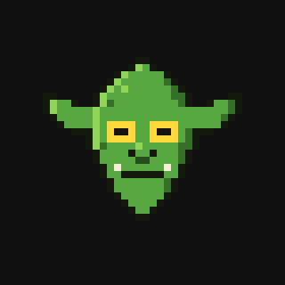

# chud

A weird little 8-bit goblin who lives on your desktop and works for you. Say
"hey chud" and talk; he answers out loud, spins up Claude Code agents for real
work, and reports back when they finish.

You can also beat him up. He has 20 damage stages and stays grumpy until he heals.



## How he works

- Voice is OpenAI Realtime over WebRTC (`gpt-realtime-2.1`); a local effect
  chain pitch-shifts and gravels everything he says, so the model speaks and a
  goblin comes out.
- The wake word runs either as an always-on Realtime transcription session
  biased toward "chud", or fully local on Vosk (`npm run get-model`, 40MB) so
  nothing leaves the box until he wakes.
- His tools spawn `claude -p` agents in the background, check their status,
  open files, apps, and URLs, and search Spotlight. Speed tiers map to models
  in `config.json`: fast is Haiku, standard is Sonnet, deep is Fable.
- The skin runs on real kinematics (`lib/skinphys.js`): the window's motion is
  differentiated into acceleration, jerk, snap, crackle, and pop, and the skin
  lags on a base-excited spring. A wild fling stretches him to double his
  breadth; a hard stop snaps back with an overshoot wobble.
- Right click punches him, and hard wall bounces hurt too. Bruises and cuts
  through stage 9, skin falls away in patches from 10, his eyes pop from
  their sockets at 15 and swing on optic threads, and at 20 only a cracked
  skull is left. Each hit plays a wet crunch plus one of 16 recorded screams,
  splats blood on a click-through overlay, and he heals one stage every
  `healSeconds`.
- The OpenAI key stays in the main process; the renderer only ever sees
  short-lived ephemeral secrets.

## Run

```sh
npm install
echo 'OPENAI_API_KEY=sk-...' > .env
npm start
```
